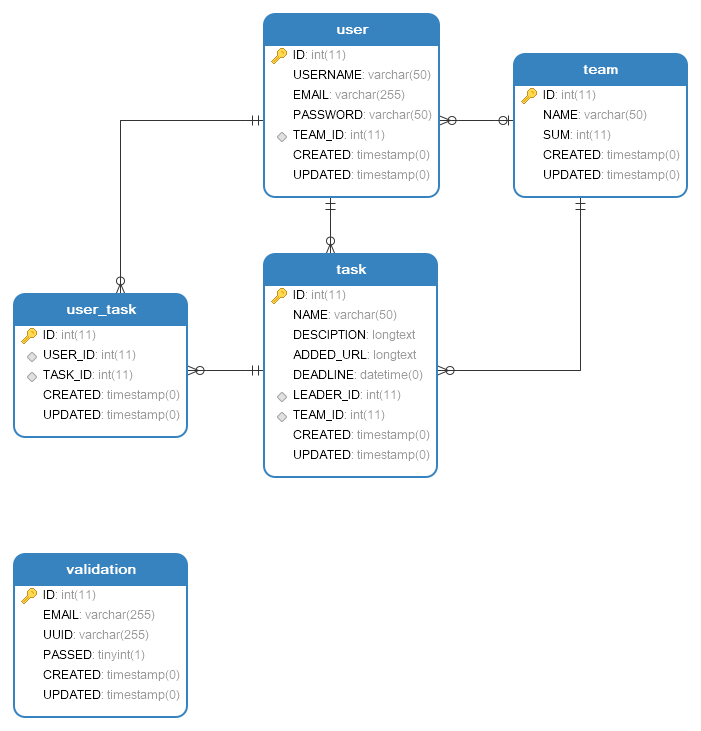

## 1 数据库设计



## 2 接口规范

### 2.1 用户注册

- URL 和 请求方式

> http://localhost:7000/user POST

- 请求参数

|参数|类型|说明|
|:----- |:-------|:----- |
|username |string |用户名 |
|password |string |密码 |

- 返回字段

|返回字段|字段类型|说明 |
|:----- |:------|:----------------------------- |
|status | int |返回结果状态。0：正常；1：错误。 |

- 接口示例

```
地址：http://localhost:7000/user
请求参数：
{
    "username": "guanpeng",
    "password": "123456"
}
返回字段：
{
    "state": 0
}
```

### 2.2 用户登陆

- URL 和 请求方式

> http://localhost:7000/user/{username} GET

- 请求参数

|参数|类型|说明|
|:----- |:-------|:----- |
|username |string |用户名 |

- 返回字段

|返回字段|字段类型|说明 |
|:----- |:------|:----------------------------- |
|status | int |返回结果状态。0：成功；1：失败。 |

- 接口示例

```
地址：http://localhost:7000/user/guanpeng
请求参数："guanpeng"
返回字段：
{
    "state": 0
}
```