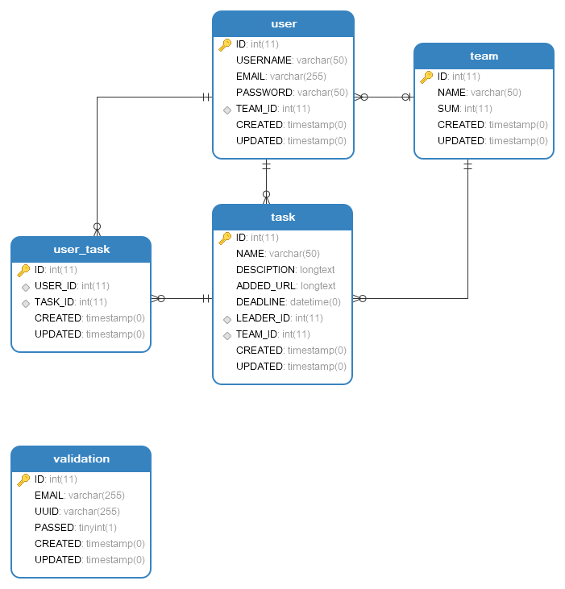

## 1 数据库设计



## 2 接口规范

### 2.1 用户注册

- URL 和 请求方式

> http://localhost:7000/signUp POST

- 请求参数

|参数|类型|说明|
|:----- |:-------|:----- |
|username |string |用户名 |
|email |string |邮箱 |
|password |string |密码 |
|team |string |团队名 |

- 返回字段

|返回字段|字段类型|说明 |
|:----- |:------|:----------------------------- |
|status | int |返回结果状态。0：错误；1：正常。 |
|message | string |状态对应内容。包括"success","email-existed-error" |

- 接口示例

```
地址：http://localhost:7000/signUp
请求参数：
{
    "username": "guanpeng",
    "email": "example@qq.com",
    "password": "123456",
    "team": "UCAS"
}
返回字段：
{
    "state": 0，
	"message": "email-existed-error"
}
```

### 2.2 用户登陆

- URL 和 请求方式

> http://localhost:7000/signIn POST

- 请求参数

|参数|类型|说明|
|:----- |:-------|:----- |
|email |string |邮箱 |
|password |string |密码 |

- 返回字段

|返回字段|字段类型|说明 |
|:----- |:------|:----------------------------- |
|status | int |返回结果状态。0：失败；1：成功。 |
|message | string |状态对应内容。包括"success","email-pwd-error" |

- 接口示例

```
地址：http://localhost:7000/signIn
请求参数：
{
    "email": "example@qq.com",
    "password": "123456"
}
返回字段：
{
    "state": 0,
	"message": "email-pwd-error"
}
```

### 2.3 获取团队全部任务/我负责的任务/我发起的任务

- URL 和 请求方式

> http://localhost:7000/getAllTask/{email} GET 团队全部任务
> http://localhost:7000/getReceiveTask/{email} GET 我负责的任务
> http://localhost:7000/getSendTask/{email} GET 我发起的任务

- 请求参数

|参数|类型|说明|
|:----- |:-------|:----- |
|email |string |邮箱 |

- 返回字段

|返回字段|字段类型|说明 |
|:----- |:------|:----------------------------- |
|status | int |返回结果状态。0：失败；1：成功。 |
|message | string |状态对应内容。包括"success","error" |
|name | string |任务名 |
|deadline | string |截止时间 |
|finished | int |返回完成状态。0：未完成；1：完成。 |
|leader | string |发起人 |

- 接口示例

```
地址：http://localhost:7000/getAllTask/example@qq.com
请求参数：
{
    "email": "example@qq.com"
}
返回字段：
{
    "status": 1,
	"message": "success",
    "data":[
        {
            "name": "task1",
            "deadline": "2017-11-07",
            "finished": 1,
            "leader": "leader1"
        },
        {
            "name": "task22",
            "deadline": "2017-11-05",
            "finished": 0,
            "leader": "leader22"
        }
    ]
    
}
```